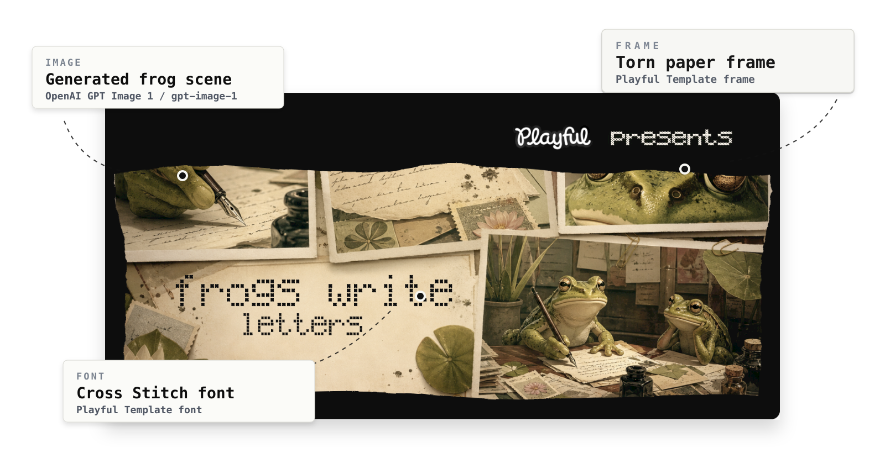
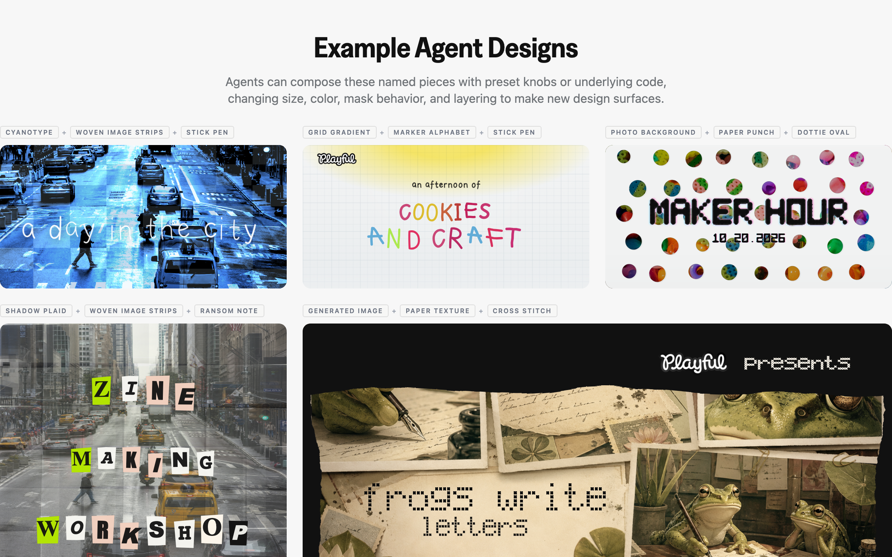

# Playful Templates

Programmatic fonts, textures, frames, and patterns from Playful. Each piece is written as code, so an agent can compose with it, a designer can export it, and the same source can render again at a different size without stacking screenshots.

[Open the playground](https://playfuldesign.app/templates)

## Install

```bash
npm i @playfuldesign/templates
```

Some templates are pure SVG/CSS. 3D templates such as Charm Bead Type use Three.js as a peer dependency.

## Agent use

Agents can pick named Playful components, tune small props like color, scale, density, mask behavior, and image inputs, then compose those pieces into repeatable designs without describing the whole poster from scratch.

Developers can use these design primitives for RL visual tasks: generate controlled design states, vary one property at a time, and score whether an agent preserved the intended visual system.





## Exports

- `@playfuldesign/templates/react`
- `SvgPatternTemplate`
- `TextureTemplate`
- `ImagePatternTemplate`
- `FrameTemplate`
- `@playfuldesign/templates/fonts/marker-alphabet`
- `@playfuldesign/templates/fonts/stick-pen`
- `@playfuldesign/templates/fonts/charm-bead`
- `@playfuldesign/templates/patterns/grid-gradient`
- `@playfuldesign/templates/textures/pencil-paper`
- `@playfuldesign/templates/frames/torn-paper`

## React example

Install the package, import the React entrypoint, and pass the same knob values you tuned in the playground.

```tsx
import { SvgPatternTemplate } from "@playfuldesign/templates/react";

export function CharmBeadHeadline() {
  return (
    <SvgPatternTemplate
      preset="charm-bead-typeface"
      text="playful!"
      typeCase="uppercase"
      color="#FFFFFF"
      density={5}
      scale={22.08}
      grain={30.1}
      contrast={31.2}
      shape={48.2}
    />
  );
}
```

```tsx
import { TornPaperFrame } from "@playfuldesign/templates/frames/torn-paper";

export function TornPhoto({ image }: { image: string }) {
  return (
    <TornPaperFrame
      paperColor="#f7f4ef"
      edgeSeed={8}
      density={9}
      scale={28}
      grain={34}
      contrast={72}
      tearShape={4}
      shadowDepth={0.8}
      style={{ width: 360, aspectRatio: "4 / 3" }}
    >
      
    </TornPaperFrame>
  );
}
```

## How these were made

The example images are AI-generated, then treated as inputs for code-native patterns, masks, frames, and type systems.

Many of the procedural patterns were developed through GPT-5.5-assisted iteration: describe the desired visual behavior, render it, inspect what feels off, then adjust the math, layering, color, and masks until the result feels usable.

- The 3D charm beads use Three.js to model depth, bevels, lighting, and bead shape. That makes the letters behave more like objects with dimension rather than flat SVG circles.
- Dottie Oval Type starts from an underlying font structure, then automates oval placement, mask fills, and curved contours around blocky shapes to create a more custom display face.
- The marker and pen alphabets began with a browser scratchpad. Chloe drew letterforms, copied the coordinates back into the agent, and the agent extrapolated the remaining glyphs into reusable SVG paths.

One tradeoff with this workflow is cleanup. Some generated or extrapolated glyphs, like an `L`, can create jagged edges in places where a designer may want a smoother curve, so the last mile still benefits from human correction.

## License

Playful Templates is licensed under Apache 2.0.

You can use Playful Templates in commercial websites, apps, games, videos, prototypes, internal tools, and other end products without visible attribution.

If you redistribute Playful Templates code as part of another shader library, plugin, or tool, please preserve the included LICENSE and NOTICE files. Visible credit such as "Powered by Playful Templates" is also appreciated and helps us continue investing in this library.

If you are interested in joining our team on research or application-layer work, or are just curious about creating better creative/design agents, email chloe@playfuldesign.app.
